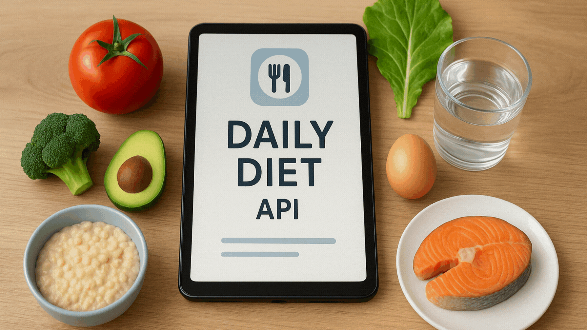

<h1 align="center">
  Daily Diet API
</h1>



## Objective

The main goal of this project was to develop a robust RESTful API for daily diet management, applying **Python, Flask and SQLAlchemy**. The application enables complete meal tracking functionality with user authentication, allowing individuals to register their daily meals, monitor dietary adherence, and access detailed nutritional statistics through a secure and performant backend system.

***

## Project Structure

- `app/`: Contains the core application logic, including routes, models, schemas, and services
- `migrations/`: Contains the database migration scripts generated by Alembic
- `instance/`: Contains the application's instance-specific configuration and database file
- `requirements.txt`: Lists the Python dependencies for the project
- `run.py`: The entry point to run the Flask application

***

## Contents

1. [Project Overview](#project-overview)  
2. [Objective](#objective)  
3. [Project Structure](#project-structure)  
4. [Technologies Used](#technologies-used)  
5. [Installation and Execution](#installation-and-execution)  
6. [Key Concepts Applied](#key-concepts-applied)  
7. [Contact](#contact)  

***

## Project Overview

Daily Diet API is a professional project that provides a complete backend solution for meal tracking applications using Flask framework, Flask-SQLAlchemy ORM for database operations, Pydantic for data validation, JWT-based authentication for secure user sessions, Flask-Migrate with Alembic for database migrations management, and cloud integrations with AWS S3 for image storage and SendGrid for email notifications.

***

## Technologies Used

- **Backend Framework**: Flask  
- **Database ORM**: Flask-SQLAlchemy  
- **Database Migrations**: Flask-Migrate with Alembic  
- **Authentication**: JWT (JSON Web Tokens)  
- **Data Validation**: Pydantic  
- **API Documentation**: OpenAPI/Swagger (implicitly via Flask endpoints)  
- **Password Hashing**: Werkzeug Security  
- **Rate Limiting**: Flask-Limiter  
- **Cloud Storage**: AWS S3 (for image uploads)  
- **Email Service**: SendGrid (for email notifications)  
- **Dependency Management**: pip

***

## Key Features

- User registration and authentication with JWT tokens
- Secure password hashing
- Complete CRUD operations for meal management
- Data isolation ensuring users only access their own meals
- Input validation using Pydantic schemas
- Detailed user statistics and metrics (total meals, diet adherence, best sequences)
- Generation of daily, weekly, and monthly meal reports
- Meal image upload to AWS S3
- Email notifications for meal reminders
- Social features:
  - Follow/unfollow other users
  - Share meals and meal plans with other users
  - View a feed of shared items from followed users
  - Public sharing of meal plans via a link

***

## Improvements to Implement

- **Automated Email Reminders**: Implement a background job (e.g., with Celery or a cron job) to automatically send meal reminders instead of relying on a manual API call
- **Advanced Social Features**:
  - Add comments and likes to shared meal plans
  - Implement a notification system for social interactions (e.g., new followers, comments)
- **Enhanced Meal Categories**: Implement a more flexible category system, allowing users to create and manage their own categories
- **Full-text search**: for meals

***

## Installation and Execution

### 1. Clone the repository  
```bash
git clone https://github.com/yourusername/daily-diet-api.git
cd daily-diet-api
```

### 2. Requirements  
- Python 3.13+
- pip (Python package manager)
- Virtual environment tool (venv)

### 3. Setup virtual environment
```bash
python -m venv .venv
source .venv/bin/activate  # On Windows: .venv\Scripts\activate
```

### 4. Install dependencies
```bash
pip install -r requirements.txt
```

### 5. Configure environment variables
Create a `.env` file in the root directory with the necessary configurations

### 6. Run database migrations
```bash
flask db upgrade
```

### 7. Start the development server
```bash
python run.py
```

***

## Key Concepts Applied

- **RESTful API Design**: The API follows REST principles for its endpoints and data representation
- **Application Factory Pattern**: The Flask application is created using an application factory (`create_app`) for better structure and testability
- **Blueprints**: The application is organised into blueprints for different modules (auth, meals, user, social)
- **Database Abstraction with ORM**: SQLAlchemy is used to interact with the database in an object-oriented way
- **Custom Decorators**: The `@token_required` decorator is used to protect routes and inject the current user into the request context
- **Environment Variable Management**: The application uses a `.env` file to manage environment variables for configuration and secrets
- **Service-Oriented Architecture**: The application is structured with a `services` layer to encapsulate external service integrations (S3, SendGrid)

***

## Contact

For questions, suggestions, or feedback, please open an issue on the repository or contact me directly via GitHub.
